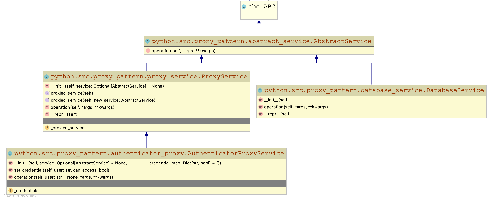

# design_patterns
A repo to contain code where I practice implementing software design patterns.
My practice started in python with the `python/` folder. Any additional languages over 
time will be in additional folders following the same naming convention (ex: Java 
implementations in a `java/`).

# Table of Contents
1. [Proxy Pattern](#proxy_pattern)

---

### Proxy Pattern 

###### Pattern Overview
* The proxy pattern is a structural design pattern which adds a hidden abstraction layer 
  between client code and implementations of necessary program logic.
* The goal of the proxy pattern is to not change the user experience of interacting 
  directly with "business logic" classes, despite injecting a middle-man.
  
###### Applications
* Suppose you have a class which conducts CRUD (<u>C</u>reate, <u>R</u>ead, <u>U</u>pdate, 
  <u>D</u>elete) operations. It might initially make sense for this class to maintain a
  persistent connection to some database. This is not inherently wrong; however, 
  connecting to database (especially in a production environment) is often slow. 
  Maintaining a persistent connection will also tie up valuable network bandwidth for the 
  database host. It would be better to delay opening a connection until absolutely 
  necessary.
* By inserting a proxy class layer in between a user and this CRUD class, you could add 
  logic for delaying a database connection, implementing access control restrictions,
  caching/batched operations, or anything else. If the design is implemented properly,
  the user experience will be functionally identical to interacting directly with the
  CRUD class.
  
###### Example Code
* Implemented in python:
    * Code in `python/src/proxy_pattern`

